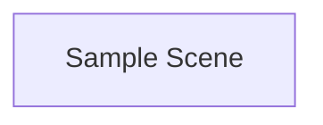
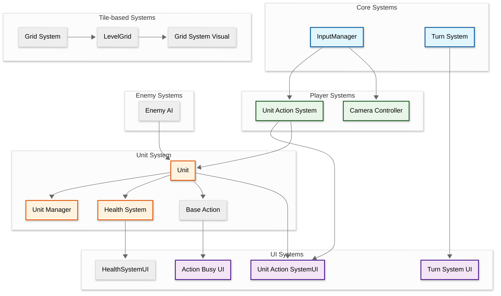
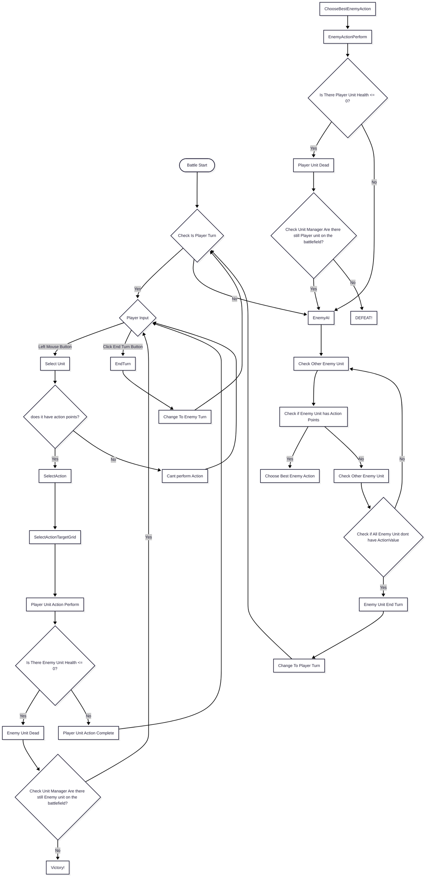
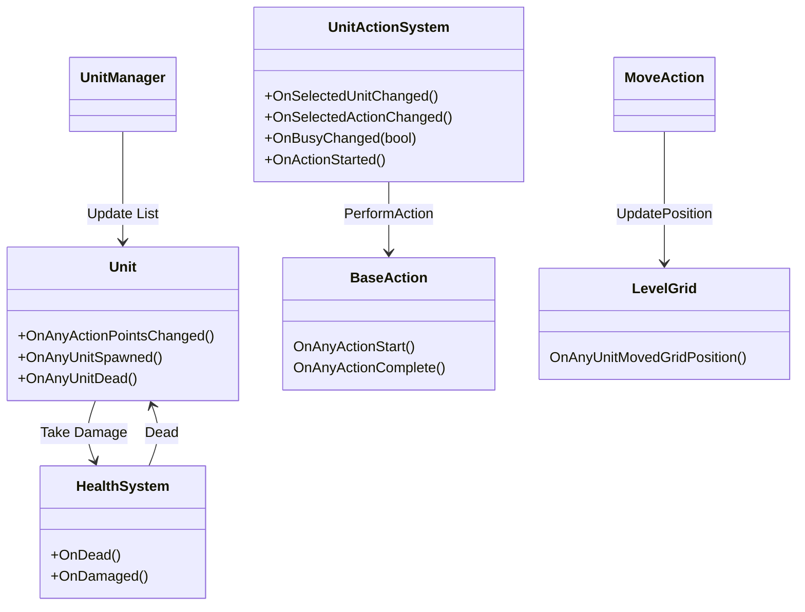

  
   

## Developer & Contributions
**Evan Jonathan** (Game Programmer)  

## About
This project focused on recreating the core mechanics of tactical RPG games such as XCOM.
The project features grid-based movement, turn-based combat, and action execution systems built on top of Tilebase system.
It was primarily developed to study and implement the Command Pattern, allowing combat actions to be executed, queued, and managed in a clean 
and scalable way.
 

 

## Key Features

• Command Pattern Implementation  
• Grid-Based Movement  
• Tilemap Combat System  
• Turn Management  
• Action Point System  
• Tactical Target Selection  
• Enemy Decision Making  

<table>
<tr>
<td align="center" width="50%">
<strong>Tile-based Combat System</strong> 

</td>
</tr>
</table>

## Scene Flow

## Layer / Module Design

## Modules and Features

The 3D Tactical turn-based Combat gameplay with Xcom-inspired GridSystem,TurnSystem, EnemyAI, and HealthSystem is powered by an extensive Unity C# scripting system.

|  📂 Name     | 🎬 Scene |  📋 Responsibility                                                 |
| ------------------- |----------------| ------------------------------------------------------------ |
| `LevelGrid` | Samplescene |Manages the tile-based grid for the level|
| `GridSystem` | Samplescene |Manages the tile-based grid system|
| `TurnSystem` | Samplescene |Manages turn order and turn progression|
|  `UnitManager.cs` | Samplescene | Manages all units on the battlefield|
| `BaseAction.cs`  | Samplescene |Abstract base class for all unit actions |
| `Unit.cs`  | Samplescene |Stores unit data and handles combat actions |
| `UnitAnimator.cs`| Samplescene | Handles unit animations and visual effects|
| `UnitActionSystem.cs`| Samplescene | Manages player input and unit actions during battle. |
| `CameraManager.cs`| Samplescene | Manages camera movement and positioning |
| `InputManager.cs`| Samplescene | Handles player input. |
| `EnemyAI.cs`| Samplescene | Manages enemy AI behavior during combat. |

 

## Game Flow Chart

 

## Event Signal Diagram

 

## Installation & Setup
1. Clone this repository
2. Open the project in Unity (6 or later recommended)
3. Open the main gameplay scene
4. Press Play to start testing

## Controls
| Key Binding       | Function          |
| ----------------- | ----------------- |
| W,A,S,D          | Move Camera |
| Scroll Wheel             | Move Up/Down Camera              |
| Left Mouse Click              | Select Unity And action |
